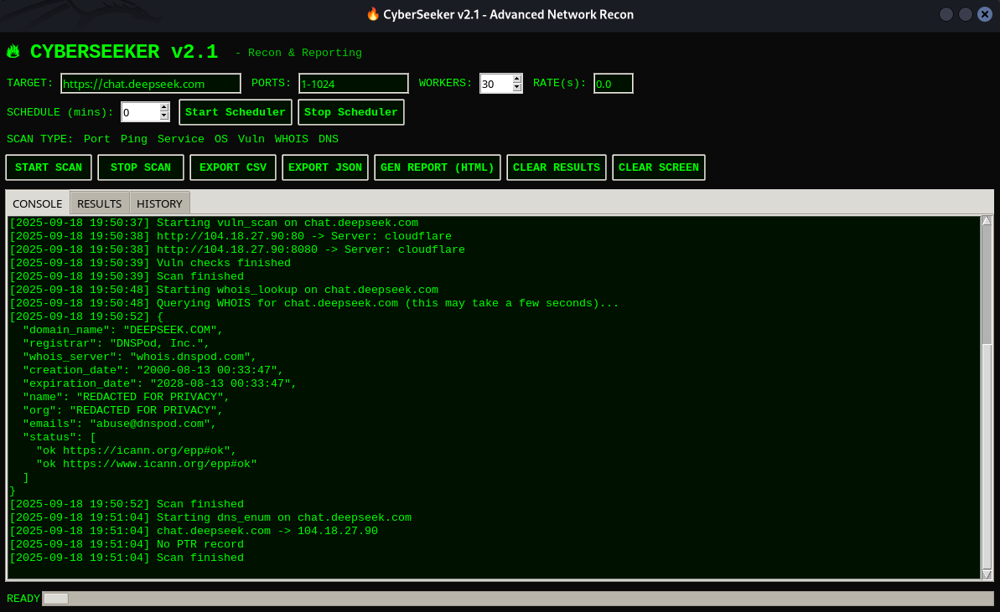

# 🔥 CyberSeeker v2.1 - Advanced Network Recon & Reporting

CyberSeeker v2.1 is a Python-based **network reconnaissance and reporting tool** with a modern **Tkinter GUI**.  
It enables ethical hackers, penetration testers, and cybersecurity students to perform recon tasks quickly and generate structured reports.

---

## ✨ Features

- **Port Scanning** (multi-threaded, service detection & banners)
- **Ping Sweep** (single host or CIDR range)
- **Service Detection** (basic, based on banners)
- **OS Fingerprinting** (via TTL heuristic)
- **Vulnerability Scan** (basic HTTP(S) headers & server checks)
- **WHOIS Lookup** (via `python-whois`)
- **DNS Enumeration** (forward & reverse lookup)
- **History Tracking** (persistent JSON history of scans & exports)
- **Export Results**  
  - CSV  
  - JSON  
  - HTML Report (opens in browser with styled tables)
- **Scheduler**: Run scans periodically (start/stop via UI)
- **Clear Console & Results** with one click
- **Modern Cyberpunk UI**: Dark mode, green neon console, colored tags

---

## 🚀 Improvements since v2.0

- ✅ **WHOIS integration** (`python-whois`)
- ✅ **Export CSV / JSON**
- ✅ **Generate HTML report**
- ✅ **Scheduler: Start/Stop periodic scans**
- ✅ **Clear Screen (console) button**
- ✅ **Colored console tags + row color hints**
- ✅ **Robust handling for WHOIS results**

---

## 🖥️ Screenshots

### Results Table

---

## 📦 Installation

### Requirements
- Python **3.8+**
- Tkinter (comes with most Python installations)

### Dependencies
Install required libraries with:

```bash
pip install requests python-whois tkintermapview
